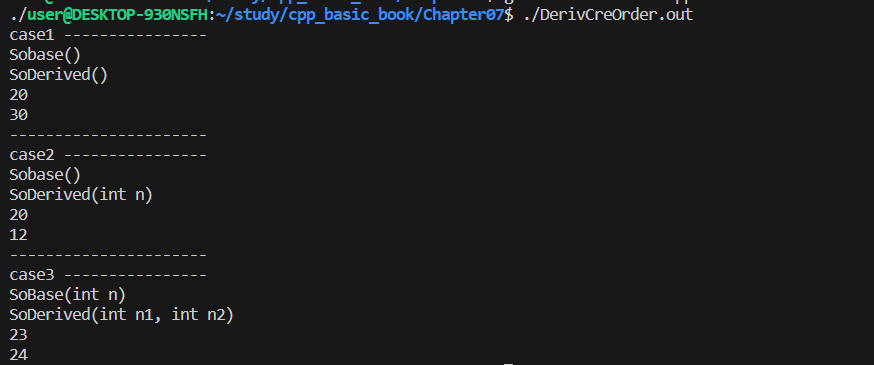

### DerivCreOrder.cpp

- Base 클래스를 정의한다
- 하위 클래스 SoDerived를 정의한다
  - 상속은 public으로 한다.


        SoDerived(int n) : derivNum(n)
        {
            cout << "SoDerived(int n)" << endl; 
        }
        // SoDerived 멤버변수와 / SoBase 멤버변수의 초기화를 진행했다
        // SoDerived Constructor와 SoBase Constructor가 호출된다.
        SoDerived(int n1, int n2) : SoBase(n1),derivNum(n2)
        {
            cout << "SoDerived(int n1, int n2)" << endl; 
        }

1. SoDerived 멤버변수만 초기화하는 경우
   - SoDerived와 SoBase의 Constructor가 호출된다.
2. SoDerived와 상속받은 SoBase의 멤버변수를 초기화하는 경우
   - SoDerived와 SoBase의 Constructor가 호출된다.

## main문

    int main()
    {
        cout << "case1 ----------------" << endl;
        SoDerived dr1;
        dr1.ShowDerivData();
        
        cout << "----------------------" << endl;
        cout << "case2 ----------------" << endl;
        SoDerived dr2(12);
        dr2.ShowDerivData();
        
        cout << "----------------------" << endl;
        cout << "case3 ----------------" << endl;
        SoDerived dr3(23,24);
        dr3.ShowDerivData();

        return 0;
    }




- case1,2 : SoDerived의 멤버 변수만 초기화되었지만
  - SoBase의 Constructor도 호출되었다.

- case3 : SoDerived와 SoBase의 멤버 변수가 초기화되었다.


다음과 같은 사실을 알 수 있다.
### 유도 클래스의 생성 과정에서 기초 클래스의 생성자는 100% 호출된다.
### 유도 클래스의 생성자에서 기초 클래스의 생성자를 명시하지 않으면, 기초 클래스의 *void를 생성* 한다.

다음의 코드가 실행될 때

    SoDerived() : derivNum(30)
    {
        cout << "SoDerived()" << endl; 
    }

- 베이스 클래스인 SoBase의 생성자가 없으므로
  - 해당 클래스의 **void 형태**를 찾아 생성자를 대신 호출한다.

        SoBase() : baseNum(20)
            {
                cout <<"Sobase()" << endl;
            }
---

- 다음과 같이 SoBase의 Constructor가 정의되어 있을때,
- (void 형태의 SoBase Constructor는 정의하지 않았다.)

```cpp
SoBase(int n) : baseNum(n)
{
    cout << "SoBase()" << baseNum << endl;
}
```

- 다음과 같이 SoBase의 Constructor를 명시하지 않으면 컴파일 에러가 발생한다.
```cpp
SoDerived(int n) : derivNum(n)
{
    cout << "SoDerived()" << derivNum << endl; 
}
```

- 코드는 다음과 같아야 한다.
  - (Base클래스의 Constructor도 명시해야 한다.)
```cpp
SoDerived(int n) : SoBase(n), derivNum(n)
```

## 유도 클래스 객체의 소멸과정


```
SoBase()15
SoDerived()15
SoBase()27
SoDerived()27
~SoDerived()27
~SoBase()27
~SoDerived()15
~SoBase()15
```

##### 이를 통해서 다음 사실들을 알 수 있다.
- 객체 소멸 순서는 다음과 같다.
   1. 유도 클래스(하위 클래스)의 소멸이 먼저 진행된다.
   2. 기초 클래스(부모 클래스)가 소멸된다.
- 특징은 다음과 같다.
  1.  **스택에 생성된 객체의 소멸순서는 생성순서와 반대이다**
        (부모 클래스가 먼저 소멸하면 하위 클래스는 오동작한다.)
    
다중 상속 구현

## Car &rightarrow; Hycar &rightarrow; HybridWaterCar

- Car Constructor
```cpp
Car(int gas) : gasolineGauge(gas)
{}
```

- Hycar Constructor
```cpp
HybridCar(int gas, int electric) 
: Car(gas), electricGauge(electric)
{}
```
- HyWatercar Constructor
```cpp
HybridWaterCar(int gas, int electric,int water)
: HybridCar(gas,electric), waterGauge(water)
{}
```

- 특징
  - HybridWaterCar의 Constructor 호출시 
  - (X) Car / HybridCar 의 Constructor 호출 + waterGauge 멤버 변수 초기화
  - -> 이 경우 Car 생성자의 중복 호출
  - (O) HybridCar의 Constructor 호출(HybridCar 생성자 호출시 Car의 생성자가 호출된다, )